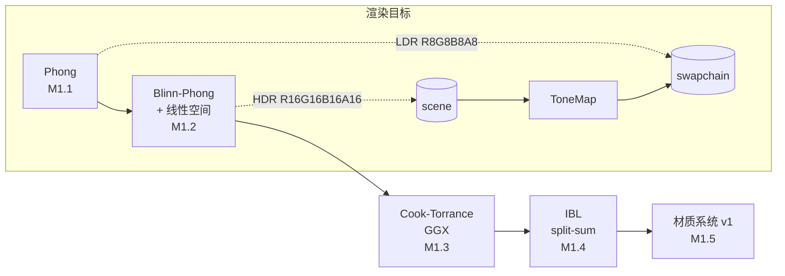
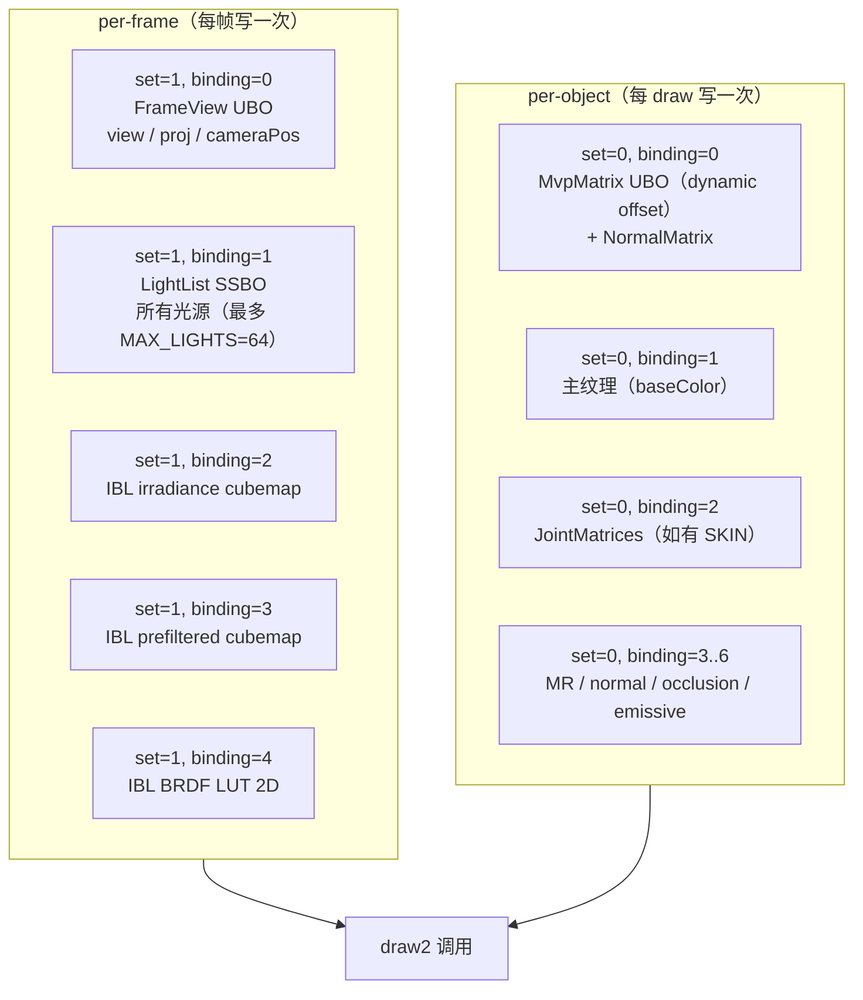
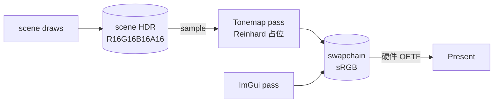
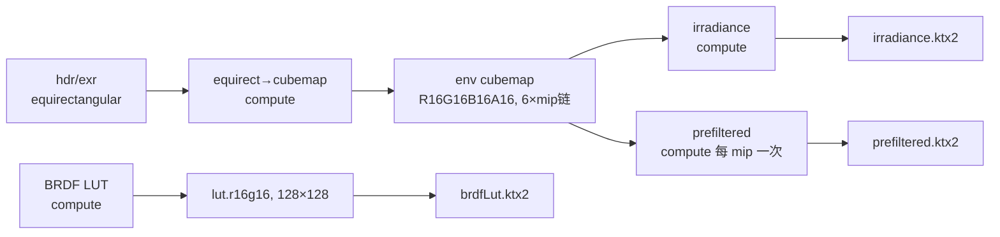

# cat 引擎 — 光照系统设计与实现方案（Phong → PBR → IBL）

> 上级：[task2.md § Phase 1](../todo/task2.md) / [架构总览](../architect/架构总览.md)
> 关联：[子系统-cat](../architect/子系统-cat.md)、[子系统-catvulkan](../architect/子系统-catvulkan.md)、[M0.3 资源 ownership 与 opaque handle 详细计划](../todo/M0.3资源ownership与opaque-handle详细计划.md)
> 前置假设：**M0.3 已经全部完成**（typed opaque handle、ShaderCache 结构化 key、`IRender` 接口签名换骨），但 M0.4（Transform dirty flag / frustum culling）尚未完成。
> 范围：覆盖 task2.md § Phase 1 全部子里程碑（M1.1 Phong → M1.2 Blinn-Phong + 线性空间 → M1.3 Cook-Torrance + GGX → M1.4 IBL split-sum → M1.5 材质系统 v1），给出**设计 + 数据结构 + 渲染路径 + shader 骨架 + 编辑器集成 + 验收**的一揽子方案。
> 定稿：2026-05-31

---

## 目录

- [一、TL;DR](#一tldr)
- [二、前置假设与现状盘点](#二前置假设与现状盘点)
- [三、总体设计](#三总体设计)
  - [3.1 着色模型演进路径](#31-着色模型演进路径)
  - [3.2 光照数据流（per-frame / per-object 分桶）](#32-光照数据流per-frame--per-object-分桶)
  - [3.3 渲染目标与色彩管线](#33-渲染目标与色彩管线)
  - [3.4 描述符集布局规约](#34-描述符集布局规约)
  - [3.5 IRender 接口扩展点](#35-irender-接口扩展点)
  - [3.6 shader 宏体系演进](#36-shader-宏体系演进)
- [四、M1.1 Phong 经典光照（~1 周）](#四m11-phong-经典光照1-周)
  - [4.1 光源类型与数据结构](#41-光源类型与数据结构)
  - [4.2 LightingComponent 与世界级光照集合](#42-lightingcomponent-与世界级光照集合)
  - [4.3 法线变换矩阵](#43-法线变换矩阵)
  - [4.4 着色器骨架](#44-着色器骨架)
  - [4.5 编辑器 Gizmo 与调试可视化](#45-编辑器-gizmo-与调试可视化)
  - [4.6 任务拆解与验收](#46-任务拆解与验收)
- [五、M1.2 Blinn-Phong + 线性空间渲染（~1 周）](#五m12-blinn-phong--线性空间渲染1-周)
  - [5.1 Half vector](#51-half-vector)
  - [5.2 切到线性空间的具体改造](#52-切到线性空间的具体改造)
  - [5.3 HDR 中间渲染目标](#53-hdr-中间渲染目标)
  - [5.4 Tonemap 占位](#54-tonemap-占位)
  - [5.5 任务拆解与验收](#55-任务拆解与验收)
- [六、M1.3 Cook-Torrance + GGX 基础 PBR（~2 周）](#六m13-cook-torrance--ggx-基础-pbr2-周)
  - [6.1 BRDF 总式](#61-brdf-总式)
  - [6.2 D / F / G 项](#62-d--f--g-项)
  - [6.3 glTF metallic-roughness 工作流](#63-gltf-metallic-roughness-工作流)
  - [6.4 切线空间法线贴图](#64-切线空间法线贴图)
  - [6.5 着色器骨架](#65-着色器骨架)
  - [6.6 任务拆解与验收](#66-任务拆解与验收)
- [七、M1.4 IBL：split-sum 近似（~3 周）](#七m14-iblsplit-sum-近似3-周)
  - [7.1 split-sum 数学](#71-split-sum-数学)
  - [7.2 资产管线：HDR → ktx2 立方体贴图](#72-资产管线hdr--ktx2-立方体贴图)
  - [7.3 离线预计算 compute pass](#73-离线预计算-compute-pass)
  - [7.4 EnvironmentProbe 数据结构](#74-environmentprobe-数据结构)
  - [7.5 着色器骨架](#75-着色器骨架)
  - [7.6 任务拆解与验收](#76-任务拆解与验收)
- [八、M1.5 材质系统 v1（~1 周，穿插）](#八m15-材质系统-v11-周穿插)
  - [8.1 数据结构](#81-数据结构)
  - [8.2 序列化（path/GUID 引用）](#82-序列化pathguid-引用)
  - [8.3 ImGui 编辑面板](#83-imgui-编辑面板)
  - [8.4 与 ShaderCache 的协作](#84-与-shadercache-的协作)
  - [8.5 任务拆解与验收](#85-任务拆解与验收)
- [九、跨里程碑横切改造点](#九跨里程碑横切改造点)
- [十、关键代码骨架](#十关键代码骨架)
  - [10.1 light.h（重写）](#101-lighth重写)
  - [10.2 material.h（v1）](#102-materialhv1)
  - [10.3 environmentProbe.h（新增）](#103-environmentprobehnew)
  - [10.4 IRender 接口增量](#104-irender-接口增量)
  - [10.5 shader 文件清单](#105-shader-文件清单)
- [十一、风险与对策](#十一风险与对策)
- [十二、出口准入与学习笔记交付](#十二出口准入与学习笔记交付)
- [十三、附录：参考资料](#十三附录参考资料)

---

## 一、TL;DR

- 光照不是一次开盘端的特性，是 RTR4 第 9 章「**Physically Based Shading**」的完整流程。本文按 task2.md 既定路线一气走完 Phong → Blinn-Phong → Cook-Torrance/GGX → IBL split-sum，并在最后做一次材质系统的整体收口。
- 核心抽象只增加三个：`Light`（三种子类型用 enum 区分而非继承）、`EnvironmentProbe`（持 IBL 资产）、`Material`（v1，glTF MR）。**不**引入完整 RHI 重抽象，**不**做 deferred shading，**不**做 cluster / tile / forward+，保持 forward-shading 单 pass。
- 渲染路径：**per-frame** uniform/SSBO 写一次（view / camera / 全部光源 / IBL 句柄）+ **per-object** dynamic uniform 写一次（model / normal / material）。利用 M0.3 已经到位的 `BufferHandle / TextureHandle` 和 ShaderCache 结构化 key。
- 色彩管线：M1.2 一次性切到 **线性空间渲染 + HDR R16G16B16A16 中间 RT + sRGB swapchain present**，Phase 8（后处理）只是把 tonemap / bloom 做精细，不再回头改色彩空间。
- IBL split-sum 用 compute shader **离线一次性生成** irradiance / prefiltered specular / BRDF LUT，按 ktx2 落 `cache/ibl/<hdr_name>.ktx2`；运行时只 load，**不**每次启动重算。
- 整个 Phase 1 完成的标志：DamagedHelmet 与 [glTF Sample Viewer](https://github.khronos.org/glTF-Sample-Viewer-Release/) 在同一张 HDR 环境下视觉无明显偏差；Sponza 在主光 + IBL 下漫反射和高光都合理；落 5 篇学习笔记。

---

## 二、前置假设与现状盘点

### 2.1 前置假设：M0.3 已全部完成

本文档默认下列改造已完成（出自 `M0.3资源ownership与opaque-handle详细计划.md`）：

- `catbase/cat/handle.h` 已入仓，三类 handle struct（`TextureHandle / BufferHandle / ShaderHandle`）与 sentinel 常量可用；
- `IRender` 接口已完成签名换骨，仓库内 GPU 句柄 `void*` 数为 0；`createTexture` 返回 `TextureHandle`、`createShader` 返回 `ShaderHandle`、`createVertexBuffer/IndexBuffer` 返回 `BufferHandle`；
- `Material::texture()` 返回 `TextureHandle`；`Shader::deviceShader()` 返回 `ShaderHandle`；`Primitive` 的设备资源持有都改成 handle；
- `ShaderCache` 已切到结构化 key（`ShaderKey { vsPathHash, psPathHash, macroSetHash }`）+ canonical macro sort + `scl::hash_table`；
- `Env::getTextureFile / releaseTextureFile` 维持 ref count 风格，外部签名不变，但内部 handle 类型已换骨。

本文 §10 给出的 C++ 骨架以及 §3.5 给出的 `IRender` 增量，都建立在这套类型系统之上。

### 2.2 现状盘点：当前光照能力是什么

- `cat/light.h` 是占位类型：仅 `m_color` + `m_transform`，未驱动任何 shader uniform，未参与 draw。
- `cat/shaderCache.h` 已经支持「在原 shader 基础上加宏派生新 shader」（`addMacro / removeMacro`），可以直接复用做光照宏变体。
- 当前唯一的对象着色器（`testCat/shader/vulkan/object.{vert,frag}`）只支持 `TEXTURE / SKIN / COLOR / NORMAL / TANGENT / PICK` 几个宏；fragment 阶段只做 `texture(tex, uv) * color` 的乘法着色，没有任何光照计算、没有 view、没有 normal 转世界、没有 light list。
- `catvulkan/cat/vulkanRender.cpp` 的 `_fillUniformData`（line 776）目前只填三个 binding：`binding=0` mvp、`binding=1` 主纹理、`binding=2` joint matrix。所有 dynamic uniform 写入都走单一的 frame uniform buffer，按 `minUniformBufferOffsetAlignment` 对齐切片。
- `m_colorFormat` 当前是 `VK_FORMAT_R8G8B8A8_UNORM`（linear UNORM），swapchain 直接 present；没有任何中间 HDR 渲染目标，没有任何后处理 pass。
- `Material` 只持 `TextureFile*`，无 factor、无 normal/emissive/MR 槽位、无序列化。

### 2.3 现状盘点：当前不能依赖什么

- M0.4 的 Transform dirty flag / frustum culling / `globalMatrix` 缓存还**没做**。Phase 1 的法线矩阵推导和 IBL 探针位置查询都会沿父链走 `Object::globalMatrix()`，本文按"重算可接受"处理；M0.4 完成后是无感优化，**不**预先与 dirty flag 耦合。
- 还**没有**通用 frame-stat / GPU profiling 面板。Phase 1 的"光照分量调试可视化"会临时落在 ImGui 的一个 Debug 子页上，等 Phase 7 / Phase 8 做面板系统时再统一。
- 还**没有** compute pipeline 通路。M1.4 的离线预计算需要新增 `IRender::dispatchCompute` 类接口，属于本 Phase 的接口增量（详见 §3.5）。

---

## 三、总体设计

### 3.1 着色模型演进路径



四个演进点用同一个 shader 家族（`object_pbr.{vert,frag}`）+ 宏变体承载，而**不**用四套独立 shader：

| 阶段 | 关键宏 | 行为差异 |
|---|---|---|
| M1.1 Phong | `LIGHTING_PHONG` | ambient + Lambert + `(R·V)^n` specular |
| M1.2 Blinn-Phong | `LIGHTING_BLINN_PHONG` | ambient + Lambert + `(N·H)^n` specular |
| M1.3 PBR | `LIGHTING_PBR` | Cook-Torrance + GGX，metallic / roughness |
| M1.4 IBL | `LIGHTING_PBR` + `IBL_ENABLED` | 在 PBR 基础上加 indirect = irradiance + prefiltered + BRDF LUT |
| M1.5 | 同上 | 只是材质数据驱动 |

`LIGHTING_PHONG / LIGHTING_BLINN_PHONG / LIGHTING_PBR` 是**互斥三选一**，编辑器顶部的"Debug View → Lighting Model"下拉切换即可在线对比。这条调试可视化是 RTR4 第 9 章学习的核心抓手，**不能省**。

### 3.2 光照数据流（per-frame / per-object 分桶）

forward shading 单 pass，但 uniform 数据分两层写：



**关键决策**：

1. **set 拆分**：set=0 per-object，set=1 per-frame。set=1 的描述符集每帧只更新一次、跨所有 draw 复用；set=0 复用现有 `m_descriptorSetCache` 机制（按数据 hash 命中），逻辑上零变化，**只增 binding**。
2. **不引入 SSBO 之前先用 fixed-array UBO**：`MAX_LIGHTS=64`，每个光源 `vec4 × 4 = 64B`，总 4KB。够用且兼容性最好。Phase 2 / Phase 8 真要做 cluster shading 时再切 SSBO。
3. **MvpMatrix UBO 扩成 PerObjectUBO**：把 mvp、modelMatrix、normalMatrix（mat3 占 12 floats）一起塞，**保留 dynamic offset 机制**。新结构：
   ```glsl
   struct PerObjectUBO {
       mat4 mvp;
       mat4 model;
       mat4 normal;   // 3x3 写成 mat4，便于 std140 对齐
   };
   ```
   字节占用 192B，远低于现在 `maxUniformBufferRange - 1` 切片粒度，无碎片风险。
4. **拒绝 push constant 装光源**：push constant 128 字节兜不下 64 光源；保留给 pick color、debug view mode 等小标量。

### 3.3 渲染目标与色彩管线

| 阶段 | 主 scene RT 格式 | swapchain 格式 | tonemap |
|---|---|---|---|
| 当前 | 无（直接画 swapchain） | `R8G8B8A8_UNORM` | 无 |
| **M1.2 起** | `R16G16B16A16_SFLOAT`（HDR） | `R8G8B8A8_SRGB` | Reinhard 占位 |
| Phase 8 | 同上 | 同上 | ACES Filmic / AgX 切换 |

色彩管线落地决策：

- swapchain 切到 `*_SRGB` 格式：硬件做 OETF（linear → sRGB），shader 中**只写线性 HDR 值**。
- 纹理采样 sRGB 解码：基色 / 自发光纹理用 `VK_FORMAT_*_SRGB`，normal / MR / occlusion 用 `VK_FORMAT_*_UNORM`（数据贴图保线性）。这一条**必须**进 §8.1 `Material` 的元数据，由 `TextureFile::load` 区分 colorSpace 走不同 vkFormat。
- 中间 RT 用 R16G16B16A16_SFLOAT：占内存比 R11G11B10 大，但语义清楚，过 HDR 测试更容易。Phase 8 再视性能调整。
- 一次性把代码里手写 `pow(2.2)` / `pow(color, 1/2.2)` 全部删掉。M1.2 PR 末尾必须 `rg "pow.*2\.2"` 返回 0 行。

### 3.4 描述符集布局规约

新增 set=1 后，要为整个项目立一个**描述符集命名规约**，避免后续每加一个 pass 各写各的：

| set | 名义角色 | 生命周期 | 数据规模 |
|---|---|---|---|
| **set=0** | per-object（model / 主纹理 / joint / 材质 PBR 槽） | 每 draw 走一次 dynamic offset | < 1 KB |
| **set=1** | per-frame / per-view（view、camera、lights、IBL） | 每帧 update 一次 | ~4 KB |
| **set=2** | 预留 per-pass（shadow pass 用） | Phase 2 启用 | — |
| **set=3** | 预留 per-material（如果 v2 走 material instance） | Phase 1.5+ | — |

规约写进 `cat代码风格.mdc` 的"接口与依赖约束"段，作为新 shader 的硬约束。

### 3.5 IRender 接口扩展点

Phase 1 必须给 `IRender` 加 4 类接口（数量克制，能不加就不加）：

```cpp
// 1) per-frame uniform / SSBO（让 catvulkan 知道"哪个 binding 装 frame 数据"）
virtual void  setFrameUniform     (int bindingIndex, const void* data, int sizeInBytes) = 0;
virtual void  setFrameTexture     (int bindingIndex, TextureHandle tex) = 0;

// 2) cubemap 创建（IBL 必备）
virtual TextureHandle  createCubemap        (int faceSize, int mipLevels, PIXEL pixel) = 0;
virtual TextureHandle  loadKTX2             (const char* const filename) = 0;
virtual void           writeCubemapFace     (TextureHandle tex, int face, int mip, const void* data, int sizeInBytes) = 0;

// 3) compute pipeline（IBL 离线预计算用）
virtual ShaderHandle   createComputeShader  (const char* const cs_code) = 0;
virtual void           dispatchCompute      (
    ShaderHandle    shader,
    int             groupX,
    int             groupY,
    int             groupZ,
    const TextureHandle* srvs, int srvCount,
    const TextureHandle* uavs, int uavCount,
    const void*     pushConst, int pushConstSize) = 0;

// 4) HDR 中间 RT（render target，让 cat 知道"主 pass 渲染到 HDR、再 tonemap"）
virtual void           beginScenePassHDR    (scl::vector4& clearColorRGBA) = 0;
virtual void           endScenePassHDR      () = 0;
virtual TextureHandle  sceneColorTexture    () const = 0; // 给 tonemap pass 采样
```

- `beginScenePassHDR` / `endScenePassHDR` 与现有 `beginScenePass / endScenePass` **并存**，旧入口走旧 path（直接 present 到 swapchain）；M1.2 之后 testCat 的主循环切到 HDR 入口 + 一次 tonemap pass。两套入口都保留意味着 Pick Pass 与 IMGUI Pass 不受影响。
- `setFrameUniform` 的实现走 `m_drawContext.frameUniform` 一个独立 svkBuffer（不复用 `m_frameUniforms` 的 dynamic 切片，避免一个 buffer 既装 per-frame 又装 per-object 的混乱）。
- `dispatchCompute` 的 SRV / UAV 透传 `TextureHandle`；compute 不进 `draw2` 路径，单独走一个最小化的命令录制路径。

### 3.6 shader 宏体系演进

到 M1.5 收口时，宏总集合应是：

```
// 顶点属性
NORMAL, TANGENT, COLOR, TEXTURE, SKIN, JOINT_MATRIX_COUNT

// 光照模型（互斥三选一）
LIGHTING_PHONG | LIGHTING_BLINN_PHONG | LIGHTING_PBR

// 光源类型上限
MAX_DIRECTIONAL_LIGHTS, MAX_POINT_LIGHTS, MAX_SPOT_LIGHTS

// 材质槽
HAS_BASE_COLOR_MAP, HAS_NORMAL_MAP, HAS_METALLIC_ROUGHNESS_MAP,
HAS_OCCLUSION_MAP, HAS_EMISSIVE_MAP

// IBL
IBL_ENABLED, IBL_PREFILTER_MIP_COUNT

// 拾取
PICK

// 调试可视化
DEBUG_VIEW_NORMAL, DEBUG_VIEW_TANGENT, DEBUG_VIEW_DIFFUSE,
DEBUG_VIEW_SPECULAR, DEBUG_VIEW_LIGHTING_ONLY, DEBUG_VIEW_BASE_COLOR
```

宏顺序通过 ShaderCache canonical sort 已规整（M0.3.5 已完成），不再担心 permutation 重复。

---

## 四、M1.1 Phong 经典光照（~1 周）

### 4.1 光源类型与数据结构

**不**用继承体系（不是 `class DirectionalLight : public Light`），而是 enum + struct + 数据驱动的形式，对齐项目"少继承多组合"的取向，也方便后续 SSBO 一次性传一批。

```cpp
// cat/light.h（重写）
namespace cat {

enum LIGHT_TYPE
{
    LIGHT_TYPE_DIRECTIONAL  = 0,
    LIGHT_TYPE_POINT        = 1,
    LIGHT_TYPE_SPOT         = 2,
};

class Object;
class Transform;

class Light
{
public:
    Light();
    virtual ~Light();

    LIGHT_TYPE          type            () const                    { return m_type; }
    void                setType         (LIGHT_TYPE t)              { m_type = t; }

    scl::vector3        color           () const                    { return m_color; }
    void                setColor        (const scl::vector3& c)     { m_color = c; }

    float               intensity       () const                    { return m_intensity; }
    void                setIntensity    (float i)                   { m_intensity = i; }

    // Point/Spot 的衰减范围（线性距离，单位米）。0 表示无穷远。
    float               range           () const                    { return m_range; }
    void                setRange        (float r)                   { m_range = r; }

    // Spot 内/外锥角（弧度）。Spot 才用得到。
    float               innerCone       () const                    { return m_innerCone; }
    void                setInnerCone    (float a)                   { m_innerCone = a; }
    float               outerCone       () const                    { return m_outerCone; }
    void                setOuterCone    (float a)                   { m_outerCone = a; }

    // 关联到场景图节点（位置 / 朝向都从这个 Object 取）
    Object*             owner           () const                    { return m_owner; }
    void                setOwner        (Object* o)                 { m_owner = o; }

    // 派生量（每帧通过 owner 的 globalMatrix 算出来，不缓存）
    scl::vector3        worldPosition   () const;
    scl::vector3        worldDirection  () const;     // 朝向（DirLight / SpotLight 用）

private:
    LIGHT_TYPE          m_type;
    scl::vector3        m_color;
    float               m_intensity;
    float               m_range;
    float               m_innerCone;
    float               m_outerCone;
    Object*             m_owner;
};

} // namespace cat
```

**字段决策记录**：

- 不引入 `Light::m_position / m_rotation` 影子字段。位置和朝向**全部走 `m_owner->globalMatrix()`**，确保编辑器 Gizmo 拖动 Object 时光源自动跟随，零同步成本。
- `intensity` 与 `color` 分两个字段：调色板友好（颜色挑色相、强度调亮度），跟 UE `FLinearColor` + `Intensity` 一致。
- `innerCone / outerCone` 用弧度而非度数，与 `scl::math` 一致；编辑器 GUI 显示度数，写回时转弧度。
- `range = 0` 表示"无穷远"，与 glTF KHR_lights_punctual 的语义一致。
- **不**把光源数据塞进 `Object` 作为内嵌组件，而是单独 `Light*` 通过 `LightingComponent` 挂上去（见 §4.2）。这是为了让"一个 Object 可以挂多个光源"（虽然现在不需要，但留口子）。

### 4.2 LightingComponent 与世界级光照集合

```cpp
// cat/lightingComponent.h（新增）
namespace cat {

class Light;
class Object;

class LightingComponent
{
public:
    LightingComponent();
    ~LightingComponent();

    Light*      light       () const                    { return m_light; }
    void        setLight    (Light* l)                  { m_light = l; }    // 不接管 ownership

    bool        enabled     () const                    { return m_enabled; }
    void        setEnabled  (bool v)                    { m_enabled = v; }

    bool        castShadow  () const                    { return m_castShadow; }
    void        setCastShadow(bool v)                   { m_castShadow = v; }   // Phase 2 才生效

private:
    Light*      m_light;
    bool        m_enabled;
    bool        m_castShadow;
};

} // namespace cat
```

`LightingComponent` 走 `Object` 的可变组件数组（`m_components`，不是固定槽位）。位置：拖动 Object 即拖动光源；Object 删除时自动 `safe_delete(m_light)`。

**世界级集合**：放在 `Scene`（也可以放 `Env`，但 Light 是场景级语义，不是引擎级）：

```cpp
// cat/scene.h（增量）
class Scene
{
public:
    // ...
    void                addLight        (Light* light);     // 不接管 ownership（Object owns）
    void                removeLight     (Light* light);
    const scl::varray<Light*>& lights   () const { return m_lights; }

private:
    scl::varray<Light*> m_lights;
};
```

每帧 `Scene::draw` 入口处把启用的 light 装进一个 stack buffer，喂给 `IRender::setFrameUniform`：

```cpp
// cat/scene.cpp（增量，伪代码）
void Scene::draw(const matrix& mvp, const Camera& camera, IRender* render, bool isPick)
{
    if (!isPick)
    {
        FrameViewData       frameView;
        frameView.view          = camera.viewMatrix();
        frameView.proj          = camera.projMatrix();
        frameView.cameraPos     = camera.worldPosition();
        render->setFrameUniform(0, &frameView, sizeof(frameView));

        LightListData       lightList;
        _gatherEnabledLights(lightList);    // 内部 clip range==0 直接保留、归一化方向等
        render->setFrameUniform(1, &lightList, sizeof(lightList));
    }
    // ... 现有逐 object 渲染 ...
}
```

### 4.3 法线变换矩阵

法线变换用 inverse-transpose of upper-left 3x3 of model matrix。理由（必须写进学习笔记）：

- 顶点位置变换是 `vw = M · vo`；法线变换不是 `nw = M · no`，是 `nw = (M^{-T}) · no`。
- 推导：法线与切平面正交，`n · t = 0`。变换后仍要正交：`(M^{-T} n) · (M t) = n · M^{-1} · M · t = n · t = 0`。
- 在均匀缩放下 `M^{-T} = M`，可以省略；但 cat 引擎不限制 transform 是否含非均匀缩放，**必须老老实实算 inverse-transpose**。

落地位置：`Object::globalMatrix()` 返回 mat4 后，由 `Scene::draw` 算 normal matrix。**不**在 `Object` 上缓存 `m_globalNormalMatrix` 字段——理由：M0.4 引入 dirty flag 后才适合缓存；本里程碑保持"每帧重算"，避免与 M0.4 改造抢提交面。

性能影响估算：一个 4x4 矩阵求逆 ~50 FLOPS，每个 Object 每帧一次。1000 个 Object 就是 50K FLOPS，远低于一个 draw call 的 setup 成本，不需要预先优化。

### 4.4 着色器骨架

vertex shader `object_pbr.vert`（M1.1 阶段只用到 `LIGHTING_PHONG` 分支，但 vert 阶段四种模型公用）：

```glsl
#version 460

layout(set = 0, binding = 0, std140) uniform PerObject
{
    mat4 mvp;
    mat4 model;
    mat4 normal;     // upper-left 3x3 用 mat4 装，避免 std140 对齐坑
} obj;

layout(location = 0) in vec4 i_position;

#ifdef NORMAL
layout(location = 1) in vec3 i_normal;
#endif
#ifdef TANGENT
layout(location = 2) in vec3 i_tangent;
#endif
#ifdef TEXTURE
layout(location = 3) in vec2 i_uv;
#endif
#ifdef COLOR
layout(location = 5) in vec4 i_color;
#endif
#ifdef SKIN
layout(location = 6) in uvec4 i_joints;
layout(location = 7) in vec4  i_weights;

layout(set = 0, binding = 2, std140) uniform JointMatrices
{
    mat4 mats[JOINT_MATRIX_COUNT];
} joints;
#endif

layout(location = 0) out vec3 v_worldPos;
#ifdef NORMAL
layout(location = 1) out vec3 v_worldNormal;
#endif
#ifdef TANGENT
layout(location = 2) out vec3 v_worldTangent;
#endif
#ifdef TEXTURE
layout(location = 3) out vec2 v_uv;
#endif
#ifdef COLOR
layout(location = 4) out vec4 v_color;
#endif

void main()
{
    vec4 localPos = vec4(i_position.xyz, 1.0);

#ifdef SKIN
    mat4 skinMat = i_weights.x * joints.mats[i_joints.x]
                 + i_weights.y * joints.mats[i_joints.y]
                 + i_weights.z * joints.mats[i_joints.z]
                 + i_weights.w * joints.mats[i_joints.w];
    localPos = skinMat * localPos;
#endif

    vec4 worldPos = obj.model * localPos;
    v_worldPos    = worldPos.xyz;
    gl_Position   = obj.mvp * localPos;

#ifdef NORMAL
    v_worldNormal = normalize(mat3(obj.normal) * i_normal);
#endif
#ifdef TANGENT
    v_worldTangent = normalize(mat3(obj.normal) * i_tangent);
#endif
#ifdef TEXTURE
    v_uv = i_uv;
#endif
#ifdef COLOR
    v_color = i_color;
#endif
}
```

fragment shader `object_pbr.frag`（M1.1 关注 Phong 分支）：

```glsl
#version 460

// ---- set=0 per-object ----
#ifdef TEXTURE
layout(set = 0, binding = 1) uniform sampler2D u_baseColorMap;
#endif

// ---- set=1 per-frame ----
struct LightData
{
    vec4 positionType;   // xyz=worldPos, w=type
    vec4 directionRange; // xyz=worldDir, w=range
    vec4 colorIntensity; // rgb=color, a=intensity
    vec4 coneParams;     // x=innerCos, y=outerCos
};

layout(set = 1, binding = 0, std140) uniform FrameView
{
    mat4 view;
    mat4 proj;
    vec4 cameraPosW;   // xyz=cameraWorldPos
} frame;

layout(set = 1, binding = 1, std140) uniform LightList
{
    int       count;
    LightData lights[64];
} u_lights;

// ---- inputs ----
layout(location = 0) in vec3 v_worldPos;
#ifdef NORMAL
layout(location = 1) in vec3 v_worldNormal;
#endif
#ifdef TEXTURE
layout(location = 3) in vec2 v_uv;
#endif

#ifdef PICK
layout(push_constant) uniform PushConst
{
    vec4 pickColor;
    int  debugViewMode;
} pc;
#endif

layout(location = 0) out vec4 o_color;

// ---------- 光源衰减 ----------
float _attenuation(LightData L, vec3 worldPos)
{
    int type = int(L.positionType.w + 0.5);
    if (type == 0) // directional
        return 1.0;

    float range = L.directionRange.w;
    vec3  d     = L.positionType.xyz - worldPos;
    float dist  = length(d);
    if (range > 0.0 && dist > range)
        return 0.0;

    // glTF KHR_lights_punctual 推荐衰减：平方反比 + 平滑边界裁剪
    float att = 1.0 / max(dist * dist, 1e-4);
    if (range > 0.0)
        att *= pow(clamp(1.0 - pow(dist / range, 4.0), 0.0, 1.0), 2.0);

    if (type == 2) // spot
    {
        vec3  toLight = normalize(-d);
        float cosA    = dot(L.directionRange.xyz, -toLight);
        float t       = clamp((cosA - L.coneParams.y) / max(L.coneParams.x - L.coneParams.y, 1e-4), 0.0, 1.0);
        att *= t * t * (3.0 - 2.0 * t);
    }
    return att;
}

// ---------- Phong（M1.1） ----------
vec3 _shadePhong(vec3 N, vec3 V, vec3 baseColor)
{
    vec3 outColor = vec3(0.02) * baseColor;     // ambient 占位

    for (int i = 0; i < u_lights.count; ++i)
    {
        LightData L = u_lights.lights[i];
        int   type  = int(L.positionType.w + 0.5);
        vec3  Lvec  = (type == 0)
                      ? normalize(-L.directionRange.xyz)
                      : normalize(L.positionType.xyz - v_worldPos);
        float att   = _attenuation(L, v_worldPos);
        vec3  Lcol  = L.colorIntensity.rgb * L.colorIntensity.a * att;

        float NdotL = max(dot(N, Lvec), 0.0);
        vec3  diff  = baseColor * NdotL;

        vec3  R     = reflect(-Lvec, N);
        float RdotV = max(dot(R, V), 0.0);
        vec3  spec  = vec3(pow(RdotV, 32.0));   // M1.1 specular exponent 硬编码 32，M1.5 走材质参数

        outColor += (diff + spec) * Lcol;
    }
    return outColor;
}

void main()
{
#ifdef PICK
    o_color = pc.pickColor;
    return;
#endif

#ifdef TEXTURE
    vec3 baseColor = texture(u_baseColorMap, v_uv).rgb;
#else
    vec3 baseColor = vec3(1.0);
#endif

#ifdef NORMAL
    vec3 N = normalize(v_worldNormal);
#else
    vec3 N = vec3(0, 1, 0);
#endif
    vec3 V = normalize(frame.cameraPosW.xyz - v_worldPos);

#if defined(LIGHTING_PHONG)
    vec3 col = _shadePhong(N, V, baseColor);
#elif defined(LIGHTING_BLINN_PHONG)
    vec3 col = _shadeBlinnPhong(N, V, baseColor);   // M1.2 实现
#elif defined(LIGHTING_PBR)
    vec3 col = _shadePBR(N, V, baseColor);          // M1.3 实现
#else
    vec3 col = baseColor;
#endif

    o_color = vec4(col, 1.0);
}
```

### 4.5 编辑器 Gizmo 与调试可视化

Gizmo（落在 `testCat/gui.cpp` 的 `_drawSceneOverlay` 路径上）：

| 光源类型 | Gizmo |
|---|---|
| Directional | 一根从 owner 位置出发、沿 worldDirection 长度 2m 的箭头，颜色 = `Light::color()` |
| Point | 一个线框球，半径 = `range`（如果 range > 0，否则用编辑器默认半径 1m） |
| Spot | 一个截顶圆锥：顶点在 owner 位置、底圆半径 = `range * tan(outerCone)`，沿 worldDirection 朝下 |

Gizmo 网格用现有 `Grid` / `bonePrimitive` 同样的"动态构建小 mesh + Lines 拓扑"路径，**不**走 ImGui DrawList（深度信息会丢）。

调试可视化（fragment shader `DEBUG_VIEW_*` 系列宏）：

| 宏 | 输出 | 用途 |
|---|---|---|
| `DEBUG_VIEW_NORMAL` | `(N * 0.5 + 0.5, 1)` | 检查法线是否在世界空间正确 |
| `DEBUG_VIEW_TANGENT` | `(T * 0.5 + 0.5, 1)` | 检查切线是否正确 |
| `DEBUG_VIEW_BASE_COLOR` | `(baseColor, 1)` | 仅 albedo |
| `DEBUG_VIEW_DIFFUSE` | `diffuse 累加项` | 看漫反射贡献 |
| `DEBUG_VIEW_SPECULAR` | `spec 累加项` | 看 specular 是否压根没贡献（典型 Phong / Blinn 差异在这里） |
| `DEBUG_VIEW_LIGHTING_ONLY` | `outColor / max(baseColor, 1e-3)` | 看光照"颜色形状" |

切换通过编辑器顶 menu，**不**在运行时改宏（避免重编译），改用 `pushConstant` 传 `int debugViewMode`，fragment 内 switch。这套机制和后续 Phase 8 的 tonemap 切换通用，所以放进 `pushConst.debugViewMode`。

### 4.6 任务拆解与验收

| 子任务 | 工时 | 主要文件 |
|---|---|---|
| M1.1.1 `Light` 类重写 + `LightingComponent` | 0.5d | `cat/light.{h,cpp}`、`cat/lightingComponent.{h,cpp}` |
| M1.1.2 `Scene` 增 light list + 每帧上传 | 0.5d | `cat/scene.{h,cpp}` |
| M1.1.3 `IRender` 增 `setFrameUniform` + `VulkanRender` 实现 | 1d | `catbase/cat/IRender.h`、`catvulkan/cat/vulkanRender.{h,cpp}` |
| M1.1.4 描述符布局改造（per-frame set=1） | 1d | `catvulkan/cat/vulkanRender.cpp` `_prepareDescriptorSet` |
| M1.1.5 `object_pbr.{vert,frag}` + ShaderCache 接入 | 1d | `testCat/shader/vulkan/object_pbr.*`、`cat/env.cpp` |
| M1.1.6 编辑器：光源属性面板 + Gizmo | 1d | `testCat/gui.cpp` |
| M1.1.7 Debug View 切换（push constant 通道） | 0.5d | `cat/primitive.cpp`、shader |
| 回归 + 调参 | 0.5d | sponza demo 截图 |

**验收**：
- [ ] sponza 在 1 directional + 2 point + 1 spot 下渲染正常，Phong 高光在视线方向变化时连续变化。
- [ ] Gizmo 拖动光源 → 渲染立即更新，**无**1 帧延迟。
- [ ] `DEBUG_VIEW_NORMAL` 显示法线分布合理，没有在 SKIN 模型上看到法线扭曲（说明 skinning 后法线变换正确）。
- [ ] 学习笔记 `doc/学习笔记/Phong-光照.md` 入仓。

---

## 五、M1.2 Blinn-Phong + 线性空间渲染（~1 周）

### 5.1 Half vector

```glsl
vec3 _shadeBlinnPhong(vec3 N, vec3 V, vec3 baseColor)
{
    vec3 outColor = vec3(0.02) * baseColor;
    for (int i = 0; i < u_lights.count; ++i)
    {
        LightData L     = u_lights.lights[i];
        int   type      = int(L.positionType.w + 0.5);
        vec3  Lvec      = (type == 0)
                          ? normalize(-L.directionRange.xyz)
                          : normalize(L.positionType.xyz - v_worldPos);
        float att       = _attenuation(L, v_worldPos);
        vec3  Lcol      = L.colorIntensity.rgb * L.colorIntensity.a * att;

        float NdotL     = max(dot(N, Lvec), 0.0);
        vec3  diff      = baseColor * NdotL;

        vec3  H         = normalize(Lvec + V);
        float NdotH     = max(dot(N, H), 0.0);
        vec3  spec      = vec3(pow(NdotH, 64.0));   // Blinn 指数通常是 Phong 的 4 倍

        outColor += (diff + spec) * Lcol;
    }
    return outColor;
}
```

要点（学习笔记必写）：

- `H = normalize(L + V)`：当 `L = V` 时 `H = N` 才能产生最大高光，与几何直觉一致。
- Phong 的 `(R·V)^n` 在 grazing angle 下会出现"高光被截"的硬边（因为 R 会跑到 N 半球外），Blinn-Phong 的 `(N·H)^n` 没有这个问题，所以**外观更好且性能更好**（少一次 reflect 计算）。
- 指数换算：Blinn 指数 ≈ 4 × Phong 指数 时高光形状大致一致。
- 这是「**外观优势是工程上保留 Phong 一族算法的全部理由**」的核心证据。

### 5.2 切到线性空间的具体改造

| 改造点 | 文件 | 改法 |
|---|---|---|
| swapchain 格式 | `catvulkan/cat/vulkanRender.cpp:100` | `colorFormats[] = { VK_FORMAT_R8G8B8A8_SRGB }`，让硬件做 OETF |
| 主纹理（baseColor / emissive）格式 | `catvulkan/cat/simplevulkan.cpp:245,275,1552,1580` | 增 `colorSpace` 参数；color → `VK_FORMAT_R8G8B8A8_SRGB`，data → `VK_FORMAT_R8G8B8A8_UNORM` |
| `TextureFile` 元数据 | `catbase/cat/textureFile.h` | 加 `enum COLOR_SPACE { COLOR_SPACE_LINEAR, COLOR_SPACE_SRGB }; m_colorSpace` |
| `Material::load` | `cat/material.cpp` | baseColor / emissive → sRGB；normal / MR / occlusion → linear |
| GLES shader 残留的 `pow(..., 2.2)` | 全仓 | `rg "pow.*2\.2"` 全干掉 |

### 5.3 HDR 中间渲染目标

引入 `m_sceneRenderTarget`（在 `VulkanRender` 中新增）：

- 格式 `VK_FORMAT_R16G16B16A16_SFLOAT`
- 与 `m_pickRenderTarget` 同尺寸（surface 尺寸）
- 独立 `VkRenderPass`（loadOp=CLEAR，finalLayout=SHADER_READ_ONLY_OPTIMAL）

`beginScenePassHDR / endScenePassHDR` 走这个 RT；endScenePassHDR 之后立即触发一次 tonemap pass（compute 或 fragment 都可，本里程碑用 fragment + fullscreen triangle）：



ImGui pass 仍画到 swapchain，不进 HDR。理由：ImGui 内部颜色是 sRGB 配色，做线性化反而失真；这是 RTR4 / UE 都采用的妥协（UE 的 SlateUI 也是直接画 sRGB 到 swapchain）。

### 5.4 Tonemap 占位

`shader/vulkan/tonemap.frag`：

```glsl
#version 460
layout(set = 0, binding = 0) uniform sampler2D u_sceneHDR;
layout(location = 0) in vec2 v_uv;
layout(location = 0) out vec4 o_color;

vec3 _reinhard(vec3 x) { return x / (x + vec3(1.0)); }

void main()
{
    vec3 hdr = texture(u_sceneHDR, v_uv).rgb;
    o_color = vec4(_reinhard(hdr), 1.0);
}
```

**不**实现曝光控制、不实现 ACES。Phase 8 才做精细。这里只要"画面看起来不死黑、不爆白"。

### 5.5 任务拆解与验收

| 子任务 | 工时 |
|---|---|
| M1.2.1 swapchain → sRGB | 0.5d |
| M1.2.2 `TextureFile` 加 colorSpace 元数据 + `Material::load` 区分 | 1d |
| M1.2.3 HDR 中间 RT + `beginScenePassHDR/endScenePassHDR` | 1d |
| M1.2.4 Tonemap pass | 0.5d |
| M1.2.5 Blinn-Phong shader 分支 | 0.5d |
| M1.2.6 删除手工 `pow(2.2)` | 0.5d |
| 回归 + 截图对照 | 0.5d |

**验收**：
- [ ] sponza 在 sRGB swapchain 下颜色与 M1.1 视觉一致（**没有**变暗或变亮 2.2 次幂级别的偏移；如果有，说明纹理 sRGB 走错了）。
- [ ] `DEBUG_VIEW_BASE_COLOR` 在线性空间下与硬件 OETF 配合，外观与离线 PNG 颜色一致。
- [ ] `rg "pow.*2\.2"` 返回 0。
- [ ] HDR clamp 测试：把 Light.intensity 从 1 调到 100，画面在 Reinhard 下平滑过渡，没有 banding。
- [ ] 学习笔记 `doc/学习笔记/Blinn-Phong-与-Gamma.md` 入仓。

---

## 六、M1.3 Cook-Torrance + GGX 基础 PBR（~2 周）

### 6.1 BRDF 总式

$$
f(\mathbf{l}, \mathbf{v}) = (1 - F) \cdot \frac{c_\text{diff}}{\pi} + \frac{D(\mathbf{h}) \cdot F(\mathbf{l}, \mathbf{h}) \cdot G(\mathbf{l}, \mathbf{v}, \mathbf{h})}{4 \cdot (\mathbf{n} \cdot \mathbf{l}) \cdot (\mathbf{n} \cdot \mathbf{v})}
$$

- 漫反射部分 `c_diff / π` 用 Lambert（保守、便宜、与 IBL 同 split-sum 假设一致）。
- specular 部分是 Cook-Torrance microfacet 模型。
- `(1 - F)` 项实现能量守恒：被反射的能量不再进入漫反射通道。
- 金属：`c_diff = vec3(0)`，`F0 = baseColor`。
- 电介质：`c_diff = baseColor`，`F0 = vec3(0.04)`（IOR=1.5 的典型值）。

### 6.2 D / F / G 项

**D — GGX (Trowbridge-Reitz)**：

$$
D(\mathbf{h}) = \frac{\alpha^2}{\pi \cdot ((\mathbf{n} \cdot \mathbf{h})^2 (\alpha^2 - 1) + 1)^2}, \quad \alpha = \text{roughness}^2
$$

```glsl
float _D_GGX(float NdotH, float roughness)
{
    float a  = roughness * roughness;
    float a2 = a * a;
    float d  = (NdotH * NdotH) * (a2 - 1.0) + 1.0;
    return a2 / (3.14159265 * d * d);
}
```

**F — Schlick**：

$$
F(\mathbf{l}, \mathbf{h}) = F_0 + (1 - F_0) \cdot (1 - (\mathbf{l} \cdot \mathbf{h}))^5
$$

```glsl
vec3 _F_Schlick(float LdotH, vec3 F0)
{
    return F0 + (vec3(1.0) - F0) * pow(1.0 - LdotH, 5.0);
}
```

**G — Smith joint, GGX 对应的 Lambda**：

$$
G(\mathbf{l}, \mathbf{v}) = G_1(\mathbf{l}) \cdot G_1(\mathbf{v}), \quad G_1(\mathbf{x}) = \frac{2 (\mathbf{n} \cdot \mathbf{x})}{(\mathbf{n} \cdot \mathbf{x}) + \sqrt{\alpha^2 + (1 - \alpha^2)(\mathbf{n} \cdot \mathbf{x})^2}}
$$

工程上常用 G 和 1/(4·NdotL·NdotV) 合并简化（"visibility term"），见 Karis 2013：

```glsl
float _V_SmithGGXCorrelated(float NdotL, float NdotV, float roughness)
{
    float a    = roughness * roughness;
    float GGXV = NdotL * sqrt(NdotV * NdotV * (1.0 - a) + a);
    float GGXL = NdotV * sqrt(NdotL * NdotL * (1.0 - a) + a);
    return 0.5 / (GGXV + GGXL + 1e-5);
}
```

合并后：

```glsl
vec3 _brdfCookTorranceGGX(vec3 N, vec3 V, vec3 L, vec3 F0, float roughness)
{
    vec3  H     = normalize(V + L);
    float NdotL = max(dot(N, L), 0.0);
    float NdotV = max(dot(N, V), 0.0);
    float NdotH = max(dot(N, H), 0.0);
    float LdotH = max(dot(L, H), 0.0);

    float D     = _D_GGX(NdotH, roughness);
    vec3  F     = _F_Schlick(LdotH, F0);
    float V_ = _V_SmithGGXCorrelated(NdotL, NdotV, roughness);
    return D * V_ * F;
}
```

### 6.3 glTF metallic-roughness 工作流

glTF 标准 MR：纹理 G 通道 = roughness、B 通道 = metallic；material 上还有 `metallicFactor` / `roughnessFactor` / `baseColorFactor`。

```glsl
vec3  baseColor = baseColorFactor.rgb;
float metallic  = metallicFactor;
float roughness = roughnessFactor;

#ifdef HAS_BASE_COLOR_MAP
baseColor *= texture(u_baseColorMap, v_uv).rgb;
#endif
#ifdef HAS_METALLIC_ROUGHNESS_MAP
vec3 mr = texture(u_mrMap, v_uv).rgb;
roughness *= mr.g;
metallic  *= mr.b;
#endif

vec3 F0     = mix(vec3(0.04), baseColor, metallic);
vec3 cDiff  = mix(baseColor, vec3(0.0), metallic);
roughness   = max(roughness, 0.045);    // 避免 D 项除 0
```

`baseColorFactor` / `metallicFactor` / `roughnessFactor` 来自 `Material`（v1，§8.1），通过 set=0 binding=3 一个 `PerObjectMaterial` UBO 传入。

### 6.4 切线空间法线贴图

法线贴图采样得到 `nT ∈ [-1, 1]^3`，要转世界空间 `nW = TBN · nT`。

```glsl
#ifdef HAS_NORMAL_MAP
vec3 nT  = texture(u_normalMap, v_uv).xyz * 2.0 - 1.0;
vec3 T   = normalize(v_worldTangent);
vec3 N0  = normalize(v_worldNormal);
vec3 B   = normalize(cross(N0, T));
mat3 TBN = mat3(T, B, N0);
N = normalize(TBN * nT);
#else
N = normalize(v_worldNormal);
#endif
```

注意：

- glTF 标准里 tangent 自带 handedness（vec4 的 w 分量），但当前 `Primitive::m_attrs` 的 TANGENT 是 vec3，缺 handedness。**M1.3 期间**：先按 vec3 处理，B 用 `cross(N, T)`；如果 sponza 出现镜像 UV 区域法线翻转，再补 handedness（升级到 vec4 tangent）。优先级：等出现 bug 再修，不预投入。
- 没 tangent 的 mesh（典型：基本几何体）：fragment 内用 `dFdx / dFdy` 重建 TBN（cotangent frame），但 v0 阶段先**不实现**，缺 tangent 的 mesh 直接走"没法线贴图"分支。

### 6.5 着色器骨架

```glsl
vec3 _shadePBR(vec3 N, vec3 V, vec3 baseColor, float metallic, float roughness)
{
    vec3 F0    = mix(vec3(0.04), baseColor, metallic);
    vec3 cDiff = mix(baseColor, vec3(0.0), metallic);

    vec3 direct = vec3(0.0);
    for (int i = 0; i < u_lights.count; ++i)
    {
        LightData Ld    = u_lights.lights[i];
        int   type      = int(Ld.positionType.w + 0.5);
        vec3  Lvec      = (type == 0)
                          ? normalize(-Ld.directionRange.xyz)
                          : normalize(Ld.positionType.xyz - v_worldPos);
        float att       = _attenuation(Ld, v_worldPos);
        vec3  Lcol      = Ld.colorIntensity.rgb * Ld.colorIntensity.a * att;
        float NdotL     = max(dot(N, Lvec), 0.0);

        vec3 brdfSpec   = _brdfCookTorranceGGX(N, V, Lvec, F0, roughness);
        vec3 brdfDiff   = cDiff / 3.14159265;
        vec3 F          = _F_Schlick(max(dot(Lvec, normalize(V + Lvec)), 0.0), F0);
        vec3 kd         = (vec3(1.0) - F) * (1.0 - metallic);   // 能量守恒

        direct += (kd * brdfDiff + brdfSpec) * Lcol * NdotL;
    }

    vec3 indirect = vec3(0.03) * baseColor;     // M1.3 占位；M1.4 替换成 IBL
#ifdef IBL_ENABLED
    indirect = _evaluateIBL(N, V, baseColor, metallic, roughness, F0);
#endif

    return direct + indirect;
}
```

### 6.6 任务拆解与验收

| 子任务 | 工时 |
|---|---|
| M1.3.1 `Material` 扩 MR factor + MR / normal / occlusion 槽 | 1d |
| M1.3.2 PBR shader 分支 + BRDF 函数 | 2d |
| M1.3.3 法线贴图采样 + TBN | 1d |
| M1.3.4 glTF MR 加载（已有 base color，补 MR / normal / occlusion） | 2d |
| M1.3.5 DamagedHelmet 视觉对照（与 glTF Sample Viewer） | 1d |
| M1.3.6 ImGui 实时调 metallic/roughness slider | 0.5d |
| 学习笔记 | 1d |
| 缓冲（数学卡住时） | 2d |

**验收**：
- [ ] DamagedHelmet 在同一张 HDR 环境（M1.4 之前先用 constant ambient + 1 个 directional light 模拟太阳）下与 glTF Sample Viewer 截图视觉无明显差距（典型差异：高光形状、菲涅尔边缘）。
- [ ] Sponza 顶部金属灯笼显示金属高光、布料显示漫反射，肉眼可分辨材质差异。
- [ ] `DEBUG_VIEW_SPECULAR` 显示 grazing angle Fresnel 效应（边缘亮中心暗）。
- [ ] roughness slider 从 0 → 1，金属球高光从镜面 → 模糊到几乎不见高光，过渡连续无突变。
- [ ] 学习笔记 `doc/学习笔记/PBR-Cook-Torrance-GGX.md` 入仓。

---

## 七、M1.4 IBL：split-sum 近似（~3 周）

### 7.1 split-sum 数学

环境光积分 `Lo = ∫ Li(l) · brdf(l, v) · cosθ dω` 直接 Monte Carlo 太贵。Karis 2013 提出 split-sum：

$$
\int_\Omega L_i(\mathbf{l}) f(\mathbf{l}, \mathbf{v}) \cos\theta \, d\omega \approx \underbrace{\left(\int_\Omega L_i(\mathbf{l}) \, D(\mathbf{l}, \mathbf{v}) \cos\theta \, d\omega\right)}_{\text{prefiltered env map}} \cdot \underbrace{\left(\int_\Omega f(\mathbf{l}, \mathbf{v}) \cos\theta \, d\omega\right)}_{\text{BRDF LUT}}
$$

- 第一项：**prefiltered specular cubemap**，按 roughness 离散到 cubemap 的 mip 链上。mip 0 = 完全镜面（直接采样 env），mip N-1 = 最粗糙（接近 irradiance）。
- 第二项：**BRDF LUT**（2D texture，R16G16），输入 `(NdotV, roughness)`，输出 `(scale, bias)`，乘上 F0 得到反射率。
- 漫反射的 `Li · cosθ` 积分独立 prefilter 一次得 **irradiance cubemap**。
- 三套资产一次离线生成、运行时只采样。

### 7.2 资产管线：HDR → ktx2 立方体贴图



ktx2 用 Khronos 官方 [KTX-Software](https://github.com/KhronosGroup/KTX-Software) 或自写最小 writer。**v0 阶段自写 writer**（只覆盖 cubemap + mip 链 + R16G16B16A16_SFLOAT 这一种排布），不引入新第三方库。如果未来需要 BC6H / ASTC 压缩，再换正式 KTX-Software。

落盘路径：`<project>/cache/ibl/<hdrName>/{env,irradiance,prefiltered,brdf}.ktx2`。脏检查：源 hdr 的 mtime + cubemap 参数（`{faceSize, prefilterMipCount, sampleCount}`）哈希作为 cache key 的一部分写进文件头；不一致则重生成。

### 7.3 离线预计算 compute pass

**4 个 compute shader**：

1. **`ibl_equirect_to_cube.comp`**：把 HDR equirectangular 投影到 cubemap 6 个面。
   - groupSize `(8, 8, 1)`，每像素 1 thread。
   - 取每像素方向向量 `dir = cubeFaceDir(face, uv)` → 转球坐标 → 采样 equirect。

2. **`ibl_irradiance.comp`**：irradiance cubemap（典型 32×32，6 face）。
   - 每像素：在以 N 为轴的 cosine-weighted 半球采样 N_SAMPLES 次（典型 4096）：
     - `Li · cosθ` 累加。
   - 这一项**只跑一次**，输出 mip 0。

3. **`ibl_prefilter.comp`**：prefiltered specular cubemap（典型 128×128，mip 0..5）。
   - 每 mip 跑一次 dispatch，`roughness = mip / (mipCount - 1)`。
   - 每像素：importance sample GGX，按 `D · NdotH` 权重在 env 上做 importance sampling，2048 样本。
   - mip 0 用 roughness=0，等于直接 copy env mip 0；省一次 dispatch。

4. **`ibl_brdf_lut.comp`**：BRDF LUT（128×128，R16G16）。
   - 每像素：`(NdotV, roughness)` → 用 GGX importance sampling 算 `(F0 scale, F0 bias)`。
   - 全设备共用一张，跨场景跨 HDR 都不变。**所有项目共享同一份**，可以 commit 进仓库（仅 128×128×4 = 64 KB）。

每个 compute shader 单文件 GLSL，走 §3.5 的 `IRender::dispatchCompute` 接口。

### 7.4 EnvironmentProbe 数据结构

```cpp
// cat/environmentProbe.h（新增）
namespace cat {

class IRender;

class EnvironmentProbe
{
public:
    EnvironmentProbe();
    ~EnvironmentProbe();

    // 同步加载三套 ktx2（如果 cache 缺失，由 catbuild 工具脱机生成；运行时不重算）
    bool                load            (IRender* render, const char* const hdrSourceName);
    void                release         ();

    TextureHandle       irradiance      () const    { return m_irradiance; }
    TextureHandle       prefiltered     () const    { return m_prefiltered; }
    TextureHandle       brdfLut         () const    { return m_brdfLut; }
    int                 prefilterMipCount() const    { return m_prefilterMipCount; }

    bool                enabled         () const    { return m_enabled; }
    void                setEnabled      (bool v)    { m_enabled = v; }

    float               intensity       () const    { return m_intensity; }
    void                setIntensity    (float v)   { m_intensity = v; }

private:
    IRender*            m_render;
    TextureHandle       m_irradiance;
    TextureHandle       m_prefiltered;
    TextureHandle       m_brdfLut;
    int                 m_prefilterMipCount;
    bool                m_enabled;
    float               m_intensity;
};

} // namespace cat
```

`Scene` 持 0..1 个 `EnvironmentProbe*`；每帧 `Scene::draw` 把三个 TextureHandle 通过 `IRender::setFrameTexture(2/3/4, ...)` 装到 set=1 的 binding 2/3/4。

**只支持全场景一个全局 probe**。多 probe（box-projected / parallax-corrected）留到 Phase 2 末或 Phase 8，本里程碑不引入。

### 7.5 着色器骨架

```glsl
// 在 fragment shader 中新增
layout(set = 1, binding = 2) uniform samplerCube u_iblIrradiance;
layout(set = 1, binding = 3) uniform samplerCube u_iblPrefiltered;
layout(set = 1, binding = 4) uniform sampler2D   u_iblBrdfLut;

vec3 _evaluateIBL(vec3 N, vec3 V, vec3 baseColor, float metallic, float roughness, vec3 F0)
{
    float NdotV   = max(dot(N, V), 0.0);
    vec3  R       = reflect(-V, N);

    // diffuse indirect
    vec3  irrad   = texture(u_iblIrradiance, N).rgb;
    vec3  kS      = _F_Schlick(NdotV, F0);
    vec3  kD      = (vec3(1.0) - kS) * (1.0 - metallic);
    vec3  diffuse = kD * irrad * (baseColor / 3.14159265);

    // specular indirect
    float lod     = roughness * float(IBL_PREFILTER_MIP_COUNT - 1);
    vec3  prefilt = textureLod(u_iblPrefiltered, R, lod).rgb;
    vec2  envBrdf = texture(u_iblBrdfLut, vec2(NdotV, roughness)).rg;
    vec3  specular = prefilt * (F0 * envBrdf.x + envBrdf.y);

    return diffuse + specular;
}
```

宏 `IBL_PREFILTER_MIP_COUNT` 在加载 ktx2 后由 `EnvironmentProbe::prefilterMipCount()` 写进 ShaderMacroArray。

### 7.6 任务拆解与验收

| 子任务 | 工时 |
|---|---|
| M1.4.1 `IRender::createCubemap / dispatchCompute` 接口 + Vulkan 实现 | 2d |
| M1.4.2 `ibl_equirect_to_cube.comp` | 1d |
| M1.4.3 `ibl_irradiance.comp` | 1d |
| M1.4.4 `ibl_prefilter.comp` | 2d |
| M1.4.5 `ibl_brdf_lut.comp` + 测试落盘 ktx2 | 1d |
| M1.4.6 最小 KTX2 writer / reader | 2d |
| M1.4.7 `EnvironmentProbe` 类 + `Scene` 集成 | 1d |
| M1.4.8 shader IBL 分支 + 验收 | 1d |
| M1.4.9 缓冲 + 学习笔记 | 4d |

**验收**：
- [ ] DamagedHelmet 在 `papermill.hdr`（glTF Sample Viewer 默认环境）下视觉与官方 viewer 截图无明显偏差。
- [ ] Sponza 在 IBL + 1 directional sun 下漫反射柔和、金属灯笼可看到环境反射。
- [ ] roughness slider 从 0 → 1：prefiltered mip 从 0 → mipCount-1 平滑过渡，**无**离散 banding。
- [ ] 重启编辑器：第二次启动不重新跑 compute（cache 命中）；启动时间应回退到 M1.3 水平。
- [ ] `IRender::dispatchCompute` 之外**没有**任何引入 Vulkan compute 概念的代码出现在 `cat` 模块。
- [ ] 学习笔记 `doc/学习笔记/IBL-split-sum.md` 入仓，必含：split-sum 推导、importance sampling 推导、与 UE `FReflectionEnvironmentCubemapArray` 的对照。

---

## 八、M1.5 材质系统 v1（~1 周，穿插）

> 这一节做的是 M1.1~M1.4 期间已经"工作"但散落的材质数据的整理收口，**不引入新渲染特性**。

### 8.1 数据结构

```cpp
// cat/material.h（v1，重写）
namespace cat {

class IRender;
class Env;
class TextureFile;

class Material
{
public:
    Material();
    virtual ~Material();

    void                    release         ();

    // 三种工作流当前只支持 MR；后续若加 specular-glossiness 在这里 enum
    void                    loadFromGltf    (const cgltf_material& src, const char* const path, IRender* render, Env* env);
    void                    initSolid       (IRender* render, Env* env, const scl::vector4& baseColor, float metallic, float roughness);

    // ---- factor / scalar 参数 ----
    scl::vector4            baseColorFactor () const    { return m_baseColorFactor; }
    void                    setBaseColorFactor(const scl::vector4& v) { m_baseColorFactor = v; }
    float                   metallicFactor  () const    { return m_metallicFactor; }
    void                    setMetallicFactor(float v)  { m_metallicFactor = v; }
    float                   roughnessFactor () const    { return m_roughnessFactor; }
    void                    setRoughnessFactor(float v) { m_roughnessFactor = v; }
    scl::vector3            emissiveFactor  () const    { return m_emissiveFactor; }
    void                    setEmissiveFactor(const scl::vector3& v) { m_emissiveFactor = v; }
    float                   normalScale     () const    { return m_normalScale; }
    void                    setNormalScale  (float v)   { m_normalScale = v; }
    float                   occlusionStrength() const   { return m_occlusionStrength; }
    void                    setOcclusionStrength(float v){ m_occlusionStrength = v; }

    // ---- 纹理槽（每个槽 TextureHandle + colorSpace 内部已对齐） ----
    TextureHandle           baseColorMap        () const    { return _handleOf(m_baseColorMap); }
    TextureHandle           metallicRoughnessMap() const    { return _handleOf(m_mrMap); }
    TextureHandle           normalMap           () const    { return _handleOf(m_normalMap); }
    TextureHandle           occlusionMap        () const    { return _handleOf(m_occlusionMap); }
    TextureHandle           emissiveMap         () const    { return _handleOf(m_emissiveMap); }

    // ---- 派生：根据"哪些贴图存在"算 macro 集合（喂给 ShaderCache） ----
    void                    fillShaderMacros    (ShaderMacroArray& macros) const;

    // ---- 序列化 ----
    bool                    save                (yaml::node& out) const;
    bool                    load                (const yaml::node& in, IRender* render, Env* env);

private:
    static TextureHandle    _handleOf       (const TextureFile* tf);

private:
    IRender*                m_render;
    Env*                    m_env;

    scl::vector4            m_baseColorFactor;      // 默认 (1,1,1,1)
    float                   m_metallicFactor;       // 默认 1.0（glTF）
    float                   m_roughnessFactor;      // 默认 1.0
    scl::vector3            m_emissiveFactor;       // 默认 (0,0,0)
    float                   m_normalScale;          // 默认 1.0
    float                   m_occlusionStrength;    // 默认 1.0

    const TextureFile*      m_baseColorMap;
    const TextureFile*      m_mrMap;
    const TextureFile*      m_normalMap;
    const TextureFile*      m_occlusionMap;
    const TextureFile*      m_emissiveMap;
};

} // namespace cat
```

字段顺序、`m_` 前缀、init list 对齐都按 cat 风格 §22 严格执行。

每个 draw 一个 PerObjectMaterial UBO 上传：

```glsl
layout(set = 0, binding = 3, std140) uniform PerObjectMaterial
{
    vec4  baseColorFactor;
    vec4  emissiveScale;       // rgb=emissiveFactor, a=normalScale
    vec4  scalars;             // x=metallicFactor, y=roughnessFactor, z=occlusionStrength, w=padding
} mat;
```

### 8.2 序列化（path/GUID 引用）

- yaml 文件：`assets/materials/<name>.mat.yaml`。
- 纹理引用：**绝对禁止裸指针**入文件。统一写 `relativePath`（相对项目根）；不引入 GUID 系统（Phase 5+ 再做）。

```yaml
# 示例：DamagedHelmet 的金属外壳
name: helmet_metal
baseColorFactor: [1.0, 1.0, 1.0, 1.0]
metallicFactor: 1.0
roughnessFactor: 0.5
emissiveFactor: [1.0, 1.0, 1.0]
normalScale: 1.0
occlusionStrength: 1.0
baseColorMap: assets/DamagedHelmet/Default_albedo.png
metallicRoughnessMap: assets/DamagedHelmet/Default_metalRoughness.png
normalMap: assets/DamagedHelmet/Default_normal.png
occlusionMap: assets/DamagedHelmet/Default_AO.png
emissiveMap: assets/DamagedHelmet/Default_emissive.png
```

加载 path 走 `Env::getTextureFile` 复用既有 ref count。

### 8.3 ImGui 编辑面板

属性面板（`testCat/gui.cpp` 的 `_drawSelectedObjectProperties` 里新增 Material 折叠组）：

| 控件 | 字段 |
|---|---|
| `ColorEdit4` | baseColorFactor |
| `SliderFloat 0..1` | metallicFactor、roughnessFactor、occlusionStrength |
| `SliderFloat 0..5` | normalScale |
| `ColorEdit3 + Slider intensity` | emissiveFactor |
| 5 个 "Drag image here" 占位 | 5 张贴图槽 |

任何调整**立即生效**（材质数据在 CPU 上，下一帧 draw 自动新 UBO 切片）；按 Ctrl+Z 走 Undo（Undo 系统在 task2.md §14 横切任务中要求每加一个数值就配一个 Undo step）。

### 8.4 与 ShaderCache 的协作

`Material::fillShaderMacros` 根据"哪些贴图存在"派生宏：

```cpp
void Material::fillShaderMacros(ShaderMacroArray& macros) const
{
    if (NULL != m_baseColorMap) macros.add("HAS_BASE_COLOR_MAP");
    if (NULL != m_mrMap)        macros.add("HAS_METALLIC_ROUGHNESS_MAP");
    if (NULL != m_normalMap)    macros.add("HAS_NORMAL_MAP");
    if (NULL != m_occlusionMap) macros.add("HAS_OCCLUSION_MAP");
    if (NULL != m_emissiveMap)  macros.add("HAS_EMISSIVE_MAP");
}
```

`Primitive::draw` 第一次发现 material 改变时（material 指针不同 或 material macro 不同），通过 `ShaderCache::getShader` 拿（结构化 key 已经处理 canonical sort）。**不**做"运行时切 LIGHTING_PHONG / LIGHTING_PBR"：模型选择来自全局 debug switch，编辑器切换时全场景 invalidate 一次即可。

### 8.5 任务拆解与验收

| 子任务 | 工时 |
|---|---|
| M1.5.1 `Material` v1 数据结构 + `loadFromGltf` 扩展 | 1d |
| M1.5.2 PerObjectMaterial UBO 通路 + draw2 增 binding | 0.5d |
| M1.5.3 yaml save/load | 1d |
| M1.5.4 ImGui 属性面板 + Undo 接入 | 1d |
| M1.5.5 sponza / DamagedHelmet 全 material 校对 | 1d |
| 学习笔记 | 0.5d |

**验收**：
- [ ] sponza 所有 mesh 显示正确的 PBR；ImGui 面板能改任何参数立即看到效果。
- [ ] save / load 往返 + diff：保存到 yaml → 退出 → 重载 → 再保存，两次 yaml 文件 byte-equal。
- [ ] 学习笔记 `doc/学习笔记/材质系统-v1.md` 入仓。

---

## 九、跨里程碑横切改造点

下表列出**不属于任何单个里程碑**但贯穿 Phase 1 的改造：

| 项 | 触发里程碑 | 落地策略 |
|---|---|---|
| `IRender::setFrameUniform / setFrameTexture` | M1.1 引入，M1.2+ 复用 | 每帧 `Scene::draw` 入口一次性调用。set=1 的 descriptor set 每帧创建 1 个、跨所有 draw 复用 |
| `Camera::worldPosition()` | M1.1 需要 | `catbase/cat/camera.h` 增 getter，从 view matrix 反推（`-R^T · t`） |
| TextureFile colorSpace 标注 | M1.2 | 每个 `Material::loadXxx` 显式指定（base/emissive=SRGB，其他=LINEAR） |
| HDR scene RT + Tonemap pass | M1.2 | 见 §5.3，新增 `m_sceneRenderTarget` + `tonemap.frag` |
| Compute pipeline 通路 | M1.4 | `IRender::createComputeShader / dispatchCompute`，VulkanRender 内部新建独立 commandBuffer 与 fence |
| EnvironmentProbe 加载 | M1.4 | `Scene` 持 0..1 个 probe；ktx2 cache 命中即 load，否则离线再算 |
| Push constant 扩 debug view mode | M1.1 | `pushConst.debugViewMode` 与 pickColor 同 16 字节 push range |
| 法线矩阵每帧重算 | M1.1 起 | 不缓存（等 M0.4 完成后再优化） |
| ShaderMacroArray canonical | M0.3.5 已完成 | M1.1 / M1.3 / M1.4 加新宏直接复用 |
| `cat代码风格.mdc` 增补 descriptor set 规约 | M1.1 | 写进文件 §7 接口隔离段 |

---

## 十、关键代码骨架

### 10.1 light.h（重写）

见 [§4.1](#41-光源类型与数据结构) 的完整定义。

### 10.2 material.h（v1）

见 [§8.1](#81-数据结构) 的完整定义。

### 10.3 environmentProbe.h（new）

见 [§7.4](#74-environmentprobe-数据结构) 的完整定义。

### 10.4 IRender 接口增量

见 [§3.5](#35-irender-接口扩展点)。这里给 `VulkanRender` 内部新增成员的速记：

```cpp
// catvulkan/cat/vulkanRender.h（增量）
private:
    // per-frame set=1 资源
    svkBuffer               m_frameViewBuffer;             // FrameView UBO（cpu mapped）
    svkBuffer               m_frameLightListBuffer;        // LightList UBO
    void*                   m_frameViewMapped;
    void*                   m_frameLightListMapped;
    DescriptorAllocator*    m_frameDescriptorAllocator;    // 唯一 layout = set=1 binding 0..4
    DescriptorSet           m_frameDescriptorSet;          // 每帧 alloc 一个，beginScenePassHDR 时 update

    // HDR 主 RT
    svkRenderTarget         m_sceneRenderTarget;           // R16G16B16A16
    VkRenderPass            m_sceneRenderPass;
    svkPipeline             m_tonemapPipeline;
    svkShaderProgram        m_tonemapShader;

    // compute（M1.4 引入）
    VkCommandBuffer         m_computeCommandBuffer;
    VkFence                 m_computeFence;
    HandlePool<svkShader>   m_computeShaderPool;           // 与 graphics shader pool 独立
```

### 10.5 shader 文件清单

| 文件 | 阶段 | 用途 |
|---|---|---|
| `testCat/shader/vulkan/object_pbr.vert` | vert | 取代当前 `object.vert` |
| `testCat/shader/vulkan/object_pbr.frag` | frag | 取代当前 `object.frag` |
| `testCat/shader/vulkan/tonemap.frag` | frag | Reinhard 占位 |
| `testCat/shader/vulkan/fullscreen.vert` | vert | tonemap / 后处理 fullscreen triangle |
| `testCat/shader/vulkan/ibl_equirect_to_cube.comp` | comp | M1.4 |
| `testCat/shader/vulkan/ibl_irradiance.comp` | comp | M1.4 |
| `testCat/shader/vulkan/ibl_prefilter.comp` | comp | M1.4 |
| `testCat/shader/vulkan/ibl_brdf_lut.comp` | comp | M1.4 |

旧 `object.{vert,frag}` 在 M1.5 完成验收**之后**才能 `git rm`，期间作为对照基线保留。

---

## 十一、风险与对策

| # | 风险 | 对策 |
|---|---|---|
| 1 | M0.3 假设破灭：handle 系统未完成或有大 bug | 本 Phase 第一周末 mid-review，若 handle 系统仍有问题，**先停手**回到 M0.3 收口，不在残缺地基上叠加光照模块 |
| 2 | M1.3 PBR 数学卡住，溢出超过预算 2 周 | 优先看 LearnOpenGL PBR 章节 + Joey de Vries GitHub 实现 → 抄一份能跑 → 再回头啃 RTR4 推导。**学习笔记必须先于功能完工写到一半**；写不出笔记说明没学懂 |
| 3 | M1.4 split-sum 的 importance sampling 在 GPU 上有 NaN（low roughness 时除 0） | 给 D / V 项加 `max(_, 1e-5)` 保护；ktx2 写出后用 RenderDoc 看每个 mip 是否合理（不是全黑、不是全白） |
| 4 | sRGB 切换在某些 GPU 驱动下 swapchain 创建失败 | M1.2 实现里 `svkChooseColorFormat` 增加 sRGB 优先回退到 UNORM 的逻辑，并在 device info 面板显示当前 colorFormat。退化到 UNORM 时给 swapchain 之前手动做 OETF（fragment 内 `pow(rgb, 1.0/2.2)`），调试期可接受 |
| 5 | 多光源 forward shading 性能塌方 | 当前**不**为性能预投入；MAX_LIGHTS=64，sponza 实际只挂 ~8 个。Phase 7 / Phase 8 真要 cluster shading 时再做 |
| 6 | DamagedHelmet 与 Sample Viewer 怎么对比都对不上 | 顺序 checklist：① color space ✓ ② tangent 朝向 ✓ ③ MR 通道占用（glTF: G=roughness, B=metallic）✓ ④ Schlick F0=0.04 ✓ ⑤ HDR env 是否同一张。每一条单独验过再下一条 |
| 7 | compute pipeline 的同步语义不对 | M1.4 引入时用最保守做法：每个 dispatch 后 `vkQueueWaitIdle`，**不**追性能；Phase 7 渲染线程化时统一改 |
| 8 | IBL ktx2 cache 文件格式将来要改 | cache 文件头写 `magic + version + paramHash`，version 不匹配就重生成，不引入兼容层 |
| 9 | M1.5 yaml 序列化与 M0.5 命名清理冲突 | yaml 字段名一次性定，**写进 `cat代码风格.mdc`**，后续禁止 rename（rename 会让所有 .mat.yaml 集体失效） |

---

## 十二、出口准入与学习笔记交付

### 12.1 Phase 1 出口准入（与 task2.md 一致 + 本文具体化）

- [ ] DamagedHelmet 在 `papermill.hdr` 环境下与 [glTF Sample Viewer](https://github.khronos.org/glTF-Sample-Viewer-Release/) 视觉无明显差距（同尺寸截图 RGB 通道 MSE < 5%）
- [ ] Sponza 在 IBL + 主光下漫反射柔和、金属高光合理
- [ ] `LIGHTING_PHONG / LIGHTING_BLINN_PHONG / LIGHTING_PBR` 三种模式在 ImGui 顶 menu 可切换，每种都能渲染同一场景
- [ ] `DEBUG_VIEW_*` 六个调试视图全部可用
- [ ] sRGB swapchain + HDR scene RT + Reinhard tonemap 链路打通
- [ ] IBL ktx2 cache 命中：二次启动不重跑 compute
- [ ] `Material` v1 完整 yaml 往返
- [ ] 仓库内**没有**手写 `pow(x, 2.2)` / `pow(x, 1/2.2)`
- [ ] 仓库内**没有**任何 `cat` 模块的文件 `#include <vulkan/*>` 或 `#include <shaderc/*>`
- [ ] 五篇学习笔记齐：
  - `doc/学习笔记/Phong-光照.md`
  - `doc/学习笔记/Blinn-Phong-与-Gamma.md`
  - `doc/学习笔记/PBR-Cook-Torrance-GGX.md`
  - `doc/学习笔记/IBL-split-sum.md`
  - `doc/学习笔记/材质系统-v1.md`

### 12.2 学习笔记必含内容（每篇）

每篇笔记按 task2.md §1.8 要求结构：

1. **实现踩坑**：本里程碑实际遇到的、不止一次卡住的具体问题（每个问题：现象 → 原因 → 修复）。
2. **UE 对照**：找 UE 中对应模块的源码路径，对照 cat 实现的取舍。
   - Phong / Blinn-Phong：UE 用 GBuffer + DeferredShading，不直接做 Phong；笔记里需要写"为什么 cat 现在保留 Phong 路线 / UE 为什么早期就跳过"。
   - PBR：UE `BRDF.ush` / `MobileBasePassPixelShader.usf`。
   - IBL：UE `FReflectionEnvironmentCubemapArray` / `ReflectionEnvironmentShaders.usf`，对照其 prefilter 与 BRDF LUT 入口。
   - 材质：UE `UMaterial` / `UMaterialInstance` / MIC 链，对照 cat 当前**没**做 MIC 的取舍。
3. **参考资料链接**：每篇至少 3 个，含 1 个原 paper / talk（如 Karis SIGGRAPH 2013 PBR、Burley Disney BRDF）。
4. **概念图 / 时序图**：Mermaid 即可。

### 12.3 验收时间线

| 周 | 主要节点 |
|---|---|
| 1 | M1.1 完成 + 笔记 |
| 2 | M1.2 完成 + 笔记 |
| 3-4 | M1.3 完成 + 笔记（允许溢出到 2 周） |
| 5-7 | M1.4 完成 + 笔记（允许溢出到 3 周） |
| 8 | M1.5 完成 + 笔记 + Phase 1 总验收 |

如果在第 7 周末 M1.4 仍未拿下，**暂停 IBL 推进**，先做 M1.5 让材质系统至少 PBR 直接光照可用，把 IBL 的剩余工作记入 Phase 1.5 单独里程碑。

---

## 十三、附录：参考资料

### 13.1 核心教材

- Akenine-Möller, Haines, Hoffman, Pesce, Iwanicki, Hillaire. _Real-Time Rendering, 4th Edition_, A K Peters/CRC Press, 2018. 第 9 章 Physically Based Shading 是本 Phase 的圣经。
- Pharr, Jakob, Humphreys. _Physically Based Rendering: From Theory to Implementation, 3rd Edition_. 数学推导回填用。
- Burley, B. _Physically-Based Shading at Disney_, SIGGRAPH 2012 Course Notes. Diffuse 项的 Disney 修正等。
- Karis, B. _Real Shading in Unreal Engine 4_, SIGGRAPH 2013 Physically Based Shading in Theory and Practice Course. **split-sum 必读**。

### 13.2 实现参考

- Joey de Vries. _LearnOpenGL_ PBR 与 IBL 章节：https://learnopengl.com/PBR/Theory
- Khronos. _glTF 2.0 Specification — Appendix B: BRDF Implementation_: https://registry.khronos.org/glTF/specs/2.0/glTF-2.0.html#appendix-b-brdf-implementation
- Khronos. _glTF Sample Viewer_: https://github.com/KhronosGroup/glTF-Sample-Viewer
- Khronos. _glTF Sample Models — DamagedHelmet_ / _Sponza_: https://github.com/KhronosGroup/glTF-Sample-Models
- Filament 引擎文档. _Physically Based Rendering in Filament_: https://google.github.io/filament/Filament.html （Smith correlated G、Schlick 简化、Importance sampling 代码非常清晰）

### 13.3 工具

- RenderDoc：调 IBL prefilter / BRDF LUT 时**必装**。
- glTF Sample Viewer（在线版）：DamagedHelmet 视觉对比基线。
- HDRI Haven / PolyHaven：免费 .hdr / .exr 环境贴图。
- KTX-Software：Khronos 官方 ktx2 reader/writer（v0 可不引入，v1 起考虑）。

---

> 任务卡片可在执行中追加到本文件末尾，保留时间戳。
> 每完成一个里程碑，回 `task2.md` § Phase 1 对应小条勾 `- [x]`，并在本文件末尾加一行短回顾。
